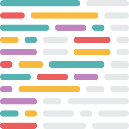

# ReX React UI Component: react-component-starter-kit

This project is part of ReX Design System and it can be used to create React UI Components.   

|| Site  | URL |
|-------------| ------------- | ------------- |
|| Github (Source Code) | https://github.com/rakuten-rex |
|| NPM (Package distribution)  | https://www.npmjs.com/org/rakuten-rex  |
|| ZeroHeight (Documentation)  | https://zeroheight.com/390c074f3 |

**Project Stack**  


| Front-end | Tools |
|-------------|-------------|
|  HTML5  CSS3 & Sass   JavaScript ES6  React |  webpack  Storybook  Babel  ESLint  Prettier |


**Features**

| Styles features |  JavaScript features |
|-------------|-------------|
| Theme support via CSS variables |  React components splitted by type |
| Static CSS styles available for HTML/VueJS/AngularJS | Universal Module Definition support |
| Sass mixins for custom builds |
| Reset CSS styles already bundled by HTML tags |
| Removed duplicated CSS props |

**Browser Support**

| PC | Mobile 
|-------------|-------------|
|  Chrome 49+ |  iOS 9+ (Safari 9.3+, Chrome 78+) |
|  Safari 9.1+ |  Android 6+ (Chrome 78+, Android Browser 76+) |
|  Firefox 31+ | |
|  MS Edge 15+ | |
|  IE 11+ | |


# How to install

```
npm install @rakuten-rex/react-component-starter-kit@2.5.2 --save
```

# Getting started

## 1) Storybook Live examples

For a complete guide of properties for React and HTML classes please visit the Storybook site:  

[](https://rakuten-rex.github.io/react-component-starter-kit/)   

https://rakuten-rex.github.io/react-component-starter-kit/   


**Storybook features**
- [x] Stories by components types
- [x] HTML raw output
- [x] JSX output
- [x] Stories source code
- [x] Knobs with multiple options


# How to integrate ReX in your project
## A) JavaScript modules

### React component (JavaScript + CSS Styles)

For plug and play components integration.   

Example: 

`my-component.jsx`

```js
import MyComponent from '@rakuten-rex/react-component-starter-kit';

function MyCustomComponent() {
  return <MyComponent />;
}
```

[Click here](https://rakuten-rex.github.io/react-component-starter-kit/) to see all working examples in Storybook.


### CSS Styles only

For your own JavaScript integration (React, Vue, Angular, etc.) or Static HTML.

Example: 

`my-component.jsx`

```js
import '@rakuten-rex/react-component-starter-kit/css';

function MyCustomComponent() {
  return (
    <div class="rex-my-component" role="presentation">
      
      <h3>Hello World</h3>
      <p>This is a basic example for ReX React Components Starter Kit</p>
    </div>
  );
}
```

[Click here](https://rakuten-rex.github.io/react-component-starter-kit/) to see all working examples in Storybook.


### Sass mixins

For your own customization of styles (React, Vue, Angular, etc.) or Static HTML.

Example: 

`my-styles.scss`

```scss
@import '@rakuten-rex/react-component-starter-kit/sass/styles.mixin';

.my-component-with-rex-styles {
  @include rex-my-component();
}
```


## B) Static HTML

Copy-paste the stylesheet `<link>` into your `<head>` before all other stylesheets to load our CSS.

**Production mode URL** (recommended for Static HTML projects):  
`https://unpkg.com/react-component-starter-kit@2.5.2/react-component-starter-kit.production.min.css`


Development mode URL (for local testing):  

`https://unpkg.com/react-component-starter-kit@2.5.2/react-component-starter-kit.development.css`


### Single component integration
Add it from our NPM CDN into your HTML template or HTML static page.

Example: 

`my-page.html`

```html
<!doctype html>
<html>
  <head>
    <meta charset="utf-8">
    <title>My Page</title>
    <!-- ReX react-component-starter-kit -->
    <link href="https://unpkg.com/react-component-starter-kit@2.5.2/react-component-starter-kit.production.min.css" rel="stylesheet">
  </head>
  <body>
    <div class="rex-my-component" role="presentation">
      
      <h3>Hello World</h3>
      <p>This is a basic example for ReX React Components Starter Kit</p>
    </div>
  </body>
</html>
```

# Development environment
## How to start the project

The development environment is based on Storybook, for more info visit https://storybook.js.org/ .   

```
npm start
```

## How to build

The build task will generate a NPM package ready to be published and also a static version of Storybook, one folder for NPM `./npm/@rakuten-rex/react-component-starter-kit` and other one for Github pages `./docs`.   

```
npm run build
```

## How to check build version

By using Node http-server, you can check the static version of Storybook with production settings and builds.

```
npm run serve
```

## How to publish to NPM
### Build the project

```
npm run build
```

### Publish to NPM

Build the project first and then publish it to NPM.  

```
npm run publish:component
```

Once the process finish, take a look to the NPM site:   

https://www.npmjs.com/package/@rakuten-rex/react-component-starter-kit


# Javascript and React related documents

Take a look to this nice documentation pages to be more familiar with React and modern Javascript:

## Official site
https://reactjs.org/docs/getting-started.html   

## Google Web Fundamentals (the whole site is a must to read)
https://developers.google.com/web/fundamentals/

## Webpack as magic bundler
https://webpack.js.org/

## Composing Software series (how to understand Funcional Programming)
https://medium.com/javascript-scene/composing-software-an-introduction-27b72500d6ea   

## Common React patterns
https://reactpatterns.com   

## Understanding Storybook with nice images
https://blog.hichroma.com/the-delightful-storybook-workflow-b322b76fd07   

## Some guidelines for clean code
https://americanexpress.io/clean-code-dirty-code/

